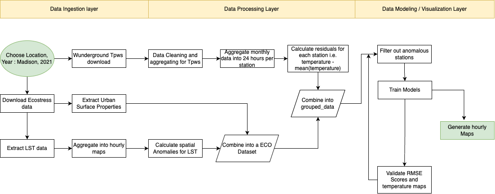

### Project Description
This project explores the development and application of a novel data architecture
for predicting ambient temperatures across US cities, focusing on integrating
multi-source data i.e. ECOSTRESS land surface temperatures, urban surface properties,
and crowdsourced weather data. 

The validation of this model across diverse urban
settings demonstrated through rigorous RMSE comparisons and spatial mapping,
validates its superiority over traditional models, hence beating benchmark models, with an average **RMSE of 0.8 degrees at 70 metre resolution**, which is the best result in this domain.

Through experiments in diverse climatic conditions in Madison, Wisconsin, and Las Vegas, Nevada, the study assesses
the model’s generalizability and effectiveness in capturing spatio-temporal temperature variations.

### Project Folder Structure

- lib -> Core implementation folder that supports data pipelines and analytics.  
- Analytics -> A combination of notebooks used for domain analysis and modeling 
- Codebase -> Data Extraction code across different regions 
- Resources -> Directory for output data 

### Data Extraction Pipeline:

1) Wunderground data  
 Procedure for extracting raw historical data from Wunderground PWS/Observation Stations/Airport. Wunder ground offers 3 different forms of products i.e. private weather stations, observation stations and airports. At first we need to get list of stations across these products and download relevant data.
 

	 - Step 1: Get the station lists:
		 - Step 1.1 Go to /Codebase/{location} for region of interest
		 - Step 1.2 Update ***wunder_config.ini*** for API_KEY and lat long ranges.
		 - Step 1.3 Run ***python list_weather_stations.py [pws/observation/airport]***. It will save corresponding file in  data/Orlando/. 
		 
		This saves a list of stations file in Codebase/data/{location}/<pws>_station_lists_<orlando>.csv. 
		
	- Step 2 :  Download the corresponding data:
            **Scripts used** : pws_script.py for pws data, observation_script.py for observation_data and parallel.py for parallelizing the operation.
            Usage : 
		 -  Usage 1 : **python parallel.py pws**  : This uses the pws_script.py , which collects data on a daily basis and hence takes time.
		 - Usage 2 : ***python parallel_obs.py,***  : This collects data from observation_script.py in monthly basis and is hence faster.

    Known Issues : You may need to go to wunderground and generate new "API KEY" time and again

Once the data collection is complete we can utilize different notebooks in Analytics/ folder to run analysis or use your own functions. The current notebooks build upon several helper libraries and processing mechanism described in lib/ folder.
   
